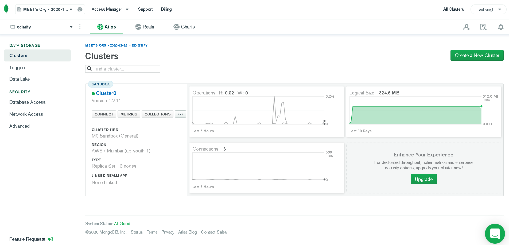

# Edgistify assignment

A MERN stack based web application that provide functionalities like login/register, uploading posts, commenting on posts etc.

Link: https://edgistify-assignment.herokuapp.com/login

## Screenshots

## Setup instructions 
First, Clone the repository and then set up database and install the dependencies.
After which project will be ready to be deployed.

### To set up database

1. Create a account on Mongodb Atlas and create a cluster.

2. Create a database in collections,

3. Get the mongodb connect url by selecting connect option and chossing connect your application.

4. Replace the dbURI in `secrets.js`, located in backend folder, with the connection url from previous step..

### To install the dependencies:

1. Move to the root directory and then run `npm install`.
2. Then move to the client directory using `cd client`and run `npm install`

## To Start the application

Go the root directory and run `npm start`.
You can access the site at localhost:3000.

## To deploy the app to Heroku

1. Create a account on Heroku.
2. Create new app.
3. Set the config variables.
4. Go to deploy tab and deploy using any option.

### Project Deployed on 
https://edgistify-assignment.herokuapp.com/login

### Project Homepage:
https://meetms7.github.io/Edgistify-Assignment/

## Built With
Express.js - Backend web framework
Heroku - Platform to deploy web applications
JSON Web Token - A standard to securely authenticate HTTP requests
Material-UI - UI library for React
MongoDB - Database to store document-based data
Mongoose - Object-modeling tool for Node.js
Node.js - Runtime environment to help build fast server applications
React - JavaScript library for building user interfaces
Redux - JavaScript library to help better manage application state

